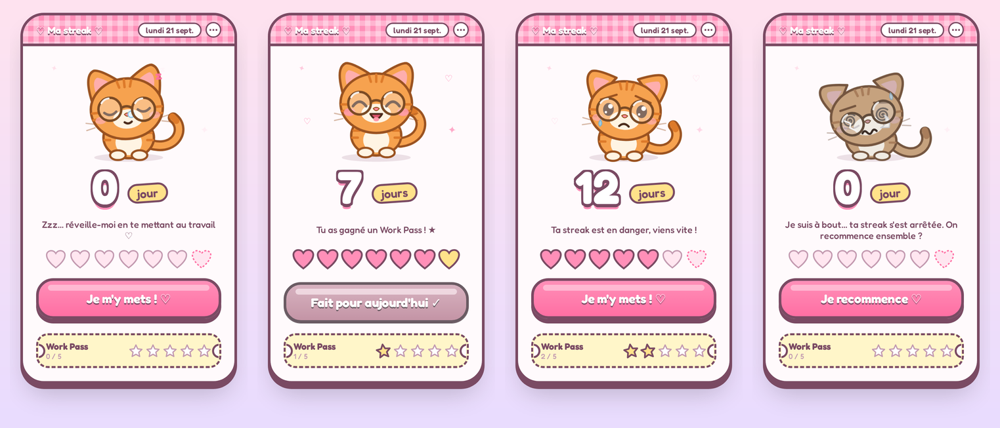

# 🐱 Streak Chat

Un petit widget de bureau (Windows) pour se motiver à travailler tous les jours : un chat mignon à lunettes qui dort, sourit, s'inquiète ou craque selon ta streak quotidienne.



## Pourquoi

Se motiver à se mettre au travail chaque jour n'est pas toujours évident. L'idée est simple : un widget toujours visible sur le bureau, avec un seul bouton à presser une fois par jour. Le chat réagit à ton comportement — il dort tant que tu n'as pas commencé, il devient content quand tu appuies, triste si la journée avance sans que tu aies appuyé, et complètement à bout si la streak est perdue.

## Fonctionnalités

- **Un bouton, une fois par jour.** Le jour est compté de minuit à minuit, heure de ton PC.
- **4 humeurs animées** : endormi, content, inquiet, à bout de forces — chacune avec ses propres animations (queue qui remue, larme qui coule, lunettes fêlées...).
- **Work Pass** : tous les 7 jours de streak, tu gagnes un pass (5 maximum). S'il t'arrive de rater une journée, un pass est automatiquement utilisé pour protéger ta streak au lieu de la remettre à zéro. Pratique pour un week-end sans PC.
- **Épinglé sur le bureau**, sous les autres fenêtres — il ne gêne jamais ton travail.
- **Lancement automatique** à l'ouverture de session Windows.
- **Anti-triche basique** : reculer l'horloge Windows ne fait pas reculer le compteur.
- Toutes les données restent **en local**, dans un simple fichier JSON sur ta machine. Aucune connexion internet, aucun compte, rien n'est envoyé nulle part.

## Installation (Windows 11 / 10)

1. Télécharge le dossier du projet (bouton vert **Code → Download ZIP** en haut de cette page, ou la dernière [Release](../../releases) si disponible) et dézippe-le.
2. Installe [Node.js](https://nodejs.org) si ce n'est pas déjà fait (version LTS).
3. Double-clique sur `INSTALLER.bat` et attends la fin de l'installation.
4. Le chat apparaît en bas à droite de ton écran. C'est terminé : il se relancera tout seul à chaque ouverture de session.

Si Windows affiche « Windows a protégé votre ordinateur » au premier lancement, c'est normal (l'application n'est pas signée numériquement) : clique sur **Informations complémentaires** puis **Exécuter quand même**.

## Utilisation

- Un clic par jour sur le bouton, quand tu te mets au travail.
- Le widget se déplace en le faisant glisser par sa barre rose du haut ; il retient sa position.
- Le bouton **⋯** (ou un clic droit sur le widget, ou l'icône près de l'horloge) ouvre un petit menu : activer/désactiver le lancement automatique, remettre le widget à sa position d'origine, ou quitter.

## Réglages

Les règles du jeu se modifient facilement dans [`logic.js`](logic.js) :

| Constante | Rôle | Valeur par défaut |
|---|---|---|
| `MAX_PASSES` | Nombre de Work Pass stockables | `5` |
| `PASS_EVERY` | Un pass gagné tous les *N* jours de streak | `7` |
| `LATE_HOUR` | Heure à partir de laquelle le chat s'inquiète si tu n'as pas encore appuyé | `17` (17h) |

Tes données sont stockées dans `%APPDATA%\Streak Chat\state.json`. Pour tout remettre à zéro, ferme le widget puis supprime ce fichier.

## Technique

Application [Electron](https://www.electronjs.org/) : une fenêtre sans bordure, transparente, épinglée derrière les autres fenêtres via l'API Windows `SetWindowPos` (module [koffi](https://koffi.dev/)). Toute la logique de streak (`logic.js`) est un module indépendant, sans dépendance à Electron — testable seul.

```
main.js       fenêtre, tray, sauvegarde, épinglage au bureau (process principal Electron)
preload.js    pont sécurisé entre l'interface et le process principal
logic.js      règles du jeu (streak, Work Pass, jours) — pas de dépendance Electron
renderer/     interface (HTML/CSS/JS + police Fredoka)
```

### Construire soi-même

```bash
npm install
npm start      # lance le widget en mode développement
npm run package  # génère l'exécutable Windows dans dist/
```

## Licence

[MIT](LICENSE) — fais-en ce que tu veux.
